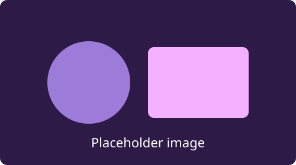

---

title: Layout gallery
description: A single deck showing the layout primitives accessible-marp-decks can render.
paginate: true
marp: true
theme: basic

---

<!-- _class: title -->

# Layout gallery

A single deck that shows off the slide template, the pre-built layouts, and the layout **primitives** in **accessible-marp-decks**. This slide uses the `title` layout — applied with `_class:` throughout this deck so the VSCode preview shows every layout too (`layout:` works the same when building).

---

## The slide template

Every slide is built on the cover shape: a top zone, the body, and a bottom zone.

This slide fills both zones with Marp's own directives — the header above and the footer below are `_header:` and `_footer:`. Build the deck with:

```sh
accessible-marp build layouts --theme basic
```

<!-- _header: 'This is the header zone' -->
<!-- _footer: 'This is the footer zone' -->

---

<!-- _class: quote -->

> Accessibility is not a feature you bolt on at the end. It is a property of building things the right way.

The `quote` layout, with this attribution line

---

<!-- _class: full-image -->



<!-- _footer: 'The `full-image` layout — the footer sits on a backing strip' -->

---

<!-- _class: section -->

## Section break

The `section` layout divides the deck into parts — like PowerPoint's Section Header.

---

<!-- _class: two-content -->

## Two content — side by side

- The `two-content` layout
- The heading spans the slide
- Two blocks sit side by side
- A block can be a list, a paragraph, an image…


<!-- _footer: 'Here the two blocks are a list and an image. Use `columns` for more blocks per side.' -->

---

<!-- _class: comparison -->

## Comparison — two content, plus captions

### Slides-first

- Start in a slides app
- Fight the outline view
- Export something inaccessible

### Content-first

- Write Markdown
- Pick a theme
- Ship accessible HTML

<!-- _footer: 'The only difference from `two-content`: an `###` heading captions each side.' -->

---

<!-- _class: content-caption -->

## Content with caption

This muted paragraph is the caption — it comes first in the source and takes the narrow column.

- The content block sits beside it
- It gets two thirds of the width
- Like PowerPoint's Content with Caption

---

<!-- _class: picture-caption -->

## Picture with caption


The muted caption sits under the picture — like PowerPoint's Picture with Caption.

---

## Title and prose

The simplest layout: a heading followed by paragraphs.

Headings get a stable id and an `aria-label`, and the paragraph text flows in a single readable column.

This is the default — write Markdown, get an accessible slide.

---

## Bulleted list

- Every slide is a labelled landmark
- Headings have stable ids
- Code blocks are keyboard-focusable figures
- Pagination is announced to screen readers
- Images keep their alt text

---

## Numbered steps

1. Write your slides in Marp markdown
2. Pick a bundled theme
3. Run the CLI, library, or Eleventy plugin
4. Ship a single, standalone accessible HTML page

---

## Columns — split a slide in two

<div class="columns">
<div class="box">

### Left

Put `columns` around two blocks to place them side by side. A slide is a fixed canvas that scales as a whole, so columns stay columns — no reflow to reason about.

</div>
<div class="box">

### Right

The columns share the width evenly.

</div>
</div>

---

## Grid — responsive cards

A `grid` auto-fits as many equal cards as will fit, each at least `14em` wide.

<div class="grid">
  <div class="box">1</div>
  <div class="box">2</div>
  <div class="box">3</div>
  <div class="box">4</div>
</div>

---

## Cluster — tags and chips

A `cluster` lays out a wrapping row of items with even gaps.

<ul class="cluster" role="list">
  <li><code>box</code></li>
  <li><code>stack</code></li>
  <li><code>cluster</code></li>
  <li><code>columns</code></li>
  <li><code>grid</code></li>
  <li><code>cover</code></li>
  <li><code>frame</code></li>
</ul>

---

## Stack — even vertical rhythm

A `stack` puts a consistent space between each child, whatever they are.

<div class="stack">
  <h3>First</h3>
  <p>The gap between items is the same all the way down.</p>
  <p>Change the rhythm with <code>stack--s</code> or <code>stack--l</code>.</p>
</div>

---

<!-- _class: cover -->

## Cover — style a whole slide

This slide uses the class directive `<!-- _class: cover -->`, which pins the heading to the top of the slide…

…and this closing line to the bottom. The `center` and `stack` slide classes work the same way.

---

## Frame — crop media to an aspect ratio

A `frame` crops an image or video to a fixed ratio (16:9 by default) so mixed media lines up.

<div class="frame">


</div>

---

## Code block

Fenced code is syntax-highlighted. A short block that fits needs no keyboard interaction, so it stays out of the tab order:

```js
import { renderDeck } from 'accessible-marp-decks'

const html = await renderDeck(markdown, { theme: 'basic' })
```

---

## Scrolling code block

When a line is too wide to fit, the block scrolls horizontally — so it becomes a focusable region you can reach with <kbd>Tab</kbd> and scroll with the arrow keys:

```js
const html = await renderDeck(markdown, { theme: 'basic', basePath: './decks/my-talk', inlineAssets: true, lang: 'en-GB', prettify: true })
```

Resize the window: a block that starts fitting drops out of the tab order, and one that starts overflowing joins it.

---

## Quote and keystrokes

> Accessibility is not a feature you bolt on at the end. It is a property of building things the right way.

Press <kbd>Tab</kbd> to move forward and <kbd>Shift</kbd> + <kbd>Tab</kbd> to move back.

---

## Table

| Helper     | Use it for                               |
| ---------- | ---------------------------------------- |
| `columns`  | Splitting a slide into equal columns     |
| `grid`     | A set of equal cards                     |
| `cluster`  | Tags, chips, button rows                 |
| `frame`    | Cropping media to a fixed aspect ratio   |

---

## Footer and links

Add a per-slide footer for sources and references.

It renders below the content and is kept out of the screen-reader pagination announcement.

<!-- _footer: '[accessible-marp-decks on npm](https://www.npmjs.com/package/accessible-marp-decks)' -->
