---

title: Common WCAG Failures
description: Session on common WCAG failures delivered for Global Accessibility Awareness day.
paginate: true
marp: true
theme: purple-theme

---

# Common WCAG failures
Craig Abbott
Head of Accessibility, Digital
[@abbott567](https://twitter.com/abbott567)

---

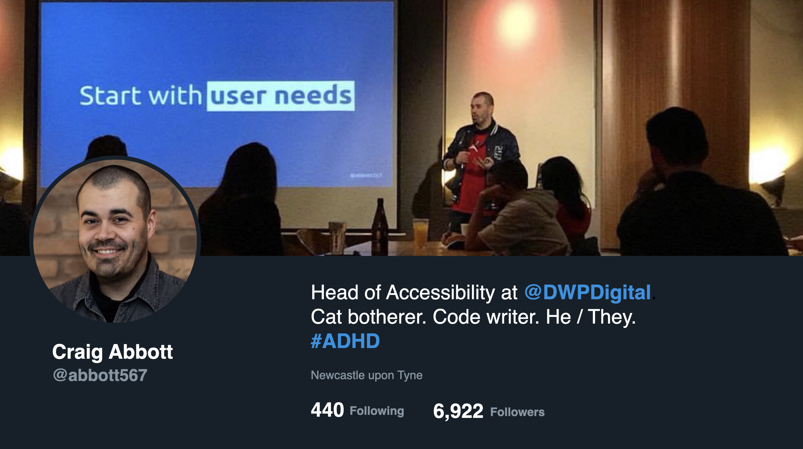

<h2 class="visually-hidden">Hello, I'm Craig</h2>

<p class="visually-hidden">
  I'm the head of accessibility at <a href="https://twitter.com/dwpdigital">DWP Digital</a>.
</p>
<p class="visually-hidden">
  I'm a cat botherer and code writer. I have combined presentation ADHD, and my pronouns are <em>He</em> or <em>They</em>, either is fine.
</p>
<p class="visually-hidden">
  You can find me on Twitter using the handle: <a href="https://twitter.com/abbott567">@abbott567</a>
</p>

---

## The Web Content Accessibility Guidelines (WCAG) are complex

We need to check against 50 criteria for WCAG 2.1 level AA, but most of the failures we see are on a small number of those.

<!-- _footer: '[Web Content Accessibility Guidelines (WCAG) 2.1](https://www.w3.org/TR/WCAG21/)' -->

---

## A years worth of audit data

Central Digital and Data Office (CDD) have released a years worth of audit data, and found most failures are on a handful of criteria. This echos our experience too.

<!-- _footer: '[Accessibility monitoring of public sector websites and mobile apps 2020-2021](https://www.gov.uk/government/publications/accessibility-monitoring-of-public-sector-websites-and-mobile-apps-2020-2021/accessibility-monitoring-of-public-sector-websites-and-mobile-apps-2020-2021)' -->

---

## On GOVUK style services, about 25% of the criteria never fail

- [1.3.4 Orientation](https://www.w3.org/WAI/WCAG21/Understanding/orientation.html)
- [1.4.2: Audio Control](https://www.w3.org/WAI/WCAG21/Understanding/audio-control.html)
- [1.4.12: Text Spacing](https://www.w3.org/WAI/WCAG21/Understanding/text-spacing.html)
- [1.4.13: Content on Hover or Focus](https://www.w3.org/WAI/WCAG21/Understanding/content-on-hover-or-focus.html)
- [2.1.4: Character Key Shortcuts](https://www.w3.org/WAI/WCAG21/Understanding/character-key-shortcuts.html)
- [2.2.2: Pause, Stop, Hide](https://www.w3.org/WAI/WCAG21/Understanding/pause-stop-hide.html)
- [2.3.1: Three Flashes or Below Threshold](https://www.w3.org/WAI/WCAG21/Understanding/three-flashes-or-below-threshold.html)
- [2.5.1: Pointer Gestures](https://www.w3.org/WAI/WCAG21/Understanding/pointer-gestures.html)
- [2.5.2: Pointer Cancellation](https://www.w3.org/WAI/WCAG21/Understanding/pointer-cancellation.html)
- [2.5.4: Motion Actuation](https://www.w3.org/WAI/WCAG21/Understanding/motion-actuation.html)

---

## In this talk

We'll look at some of the common things which *do* fail in a bit more depth.
- [1.3.1 Info and Relationships](https://www.w3.org/WAI/WCAG21/Understanding/info-and-relationships.html)
- [1.4.3 Contrast Minimum](https://www.w3.org/WAI/WCAG21/Understanding/contrast-minimum.html)
- [1.4.10 Reflow](https://www.w3.org/WAI/WCAG21/Understanding/reflow.html)
- [1.4.11 Non-text Contrast](https://www.w3.org/WAI/WCAG21/Understanding/non-text-contrast.html)
- [2.4.2 Page Titled](https://www.w3.org/WAI/WCAG21/Understanding/page-titled.html)
- [2.4.4 Link Purpose (In Context)](https://www.w3.org/WAI/WCAG21/Understanding/link-purpose-in-context.html)
- [2.4.6 Headings and Labels](https://www.w3.org/WAI/WCAG21/Understanding/headings-and-labels.html)
- [3.3.2 Labels or Instructions](https://www.w3.org/WAI/WCAG21/Understanding/labels-or-instructions.html)
- [4.1.2 Name, Role, Value](https://www.w3.org/WAI/WCAG21/Understanding/name-role-value.html)

---

## 1.4.10 Reflow

The intent of this success criterion is to support people with low vision who need to enlarge text and read it in a single column.

<!-- _footer: '[WCAG criterion 1.4.10 Reflow](https://www.w3.org/WAI/WCAG21/Understanding/reflow.html)' -->

---

### People often wrongly assume reflow does not apply

It's wrong to assume it's only for people using mobile phones. We often here people say things like:

> “We know the users will be using the Edge Browser on Windows 10 devices. They won’t be using mobile phones, so this criterion is not applicable to us!”

---

### Reflow also applies to zooming in using the browser

<div class="row">
  <div class="col">
    <p>Desktop view:</p>
    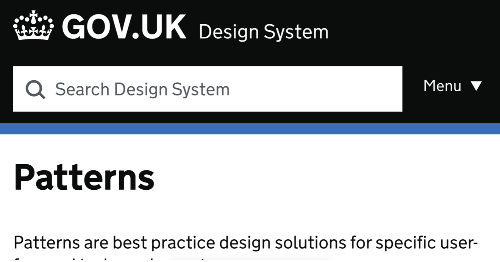
  </div>
  <div class="col">
    <p>Zoomed view:</p>
    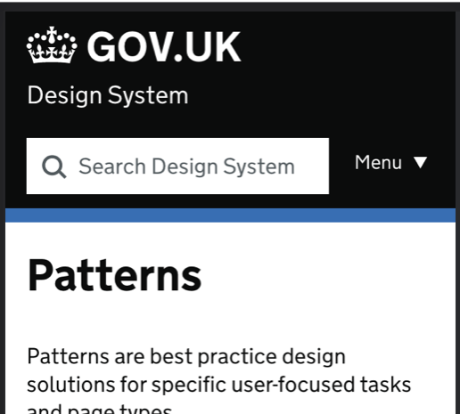
  </div>
</div>

---

### No horizontal scrolling at 320px

For reflow to pass, there must be no horizontal scrolling at 320px wide, unless it is *essential* to the understanding of the content, such as a map, a data table or a code example.

---

### Even when scrolling is allowed, it must be contained

<div class="row" style="margin-top: 0">
  <div class="col">
    <p class="visually-hidden">Good Example:</p>
    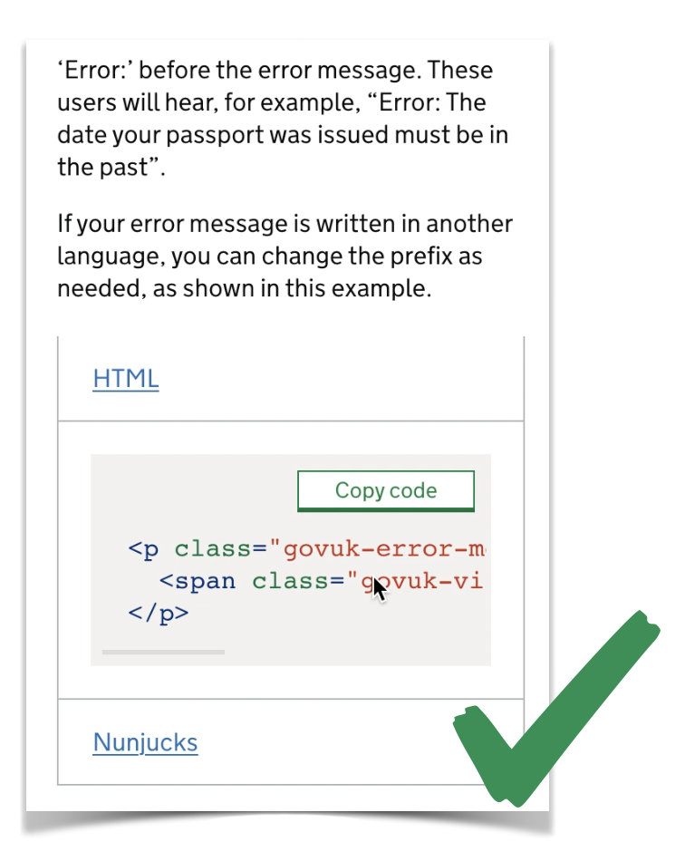
  </div>
  <div class="col">
    <p class="visually-hidden">Bad Example:</p>
    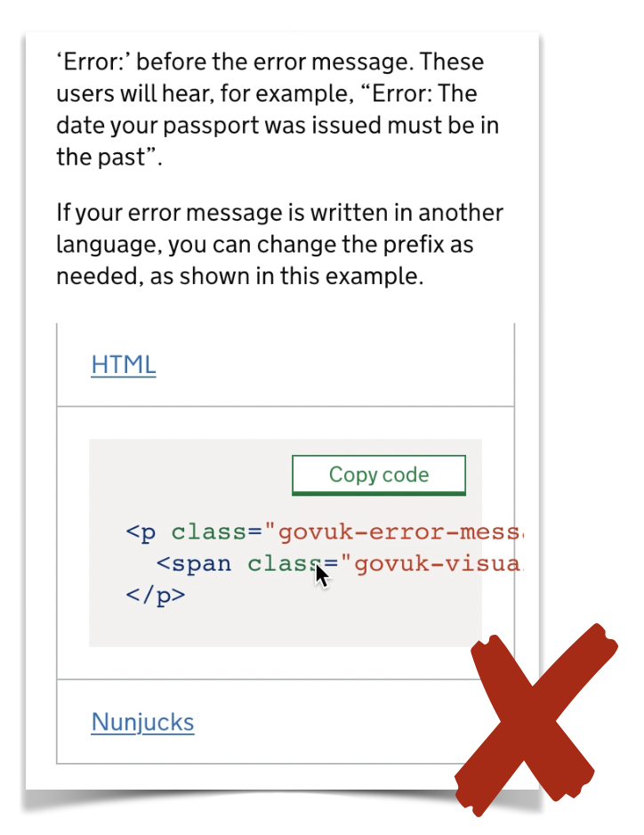
  </div>
</div>

---

### The 400% zoom misconception

There’s a myth that if you have no horizontal scrolling at 400% zoom, then you pass reflow. 

But, it’s more complicated than that. Zooming to 400% is only accurate on displays which are 1280px wide. This is because 320 multiplied by 400% is 1280.

For example:
`320px * 400% = 1280px`

---

### How to accurately test reflow

You should use the DevTools in your browser to accurately set the dimensions of the viewport.

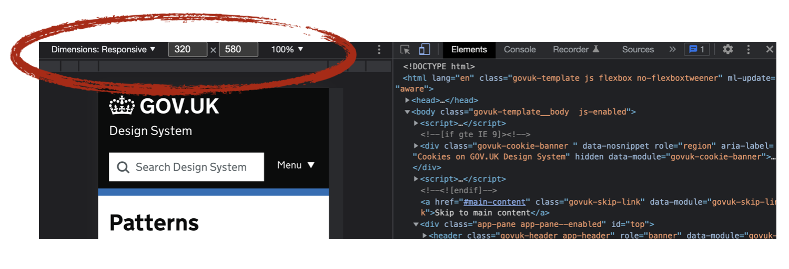

---

## 2.4.2 Page Titled

The intent of this Success Criterion is to help users find content and orient themselves within it by ensuring that each Web page has a descriptive title. Titles identify the current location without requiring users to read or interpret page content. 

<!-- _footer: '[WCAG criterion 2.4.2 Page Titled](https://www.w3.org/WAI/WCAG21/Understanding/page-titles.html)' -->

---

### Page title example

The user should be able to tell what page they’re on and which service or website they’re on from the title alone. 

You may add additional content if the website is under an umbrellar, such as GOV.UK.

```html
<title>
  What is your name? - Apply for Universal Credit - GOV.UK
</title>
```

---

### Page titles must be unique

<div class="row" style="margin-top: 0">
  <div class="col">
    <code>Your details: What is your name?</code>
    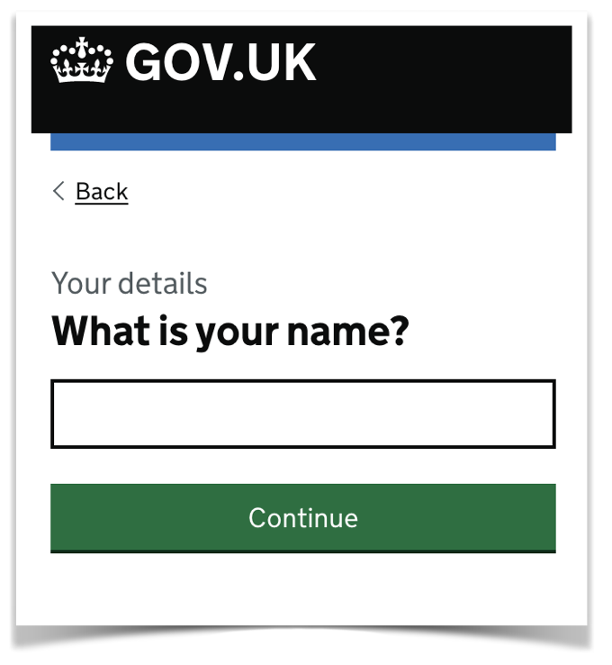
  </div>
  <div class="col">
    <code>Your details: What is your home postcode?</code>
    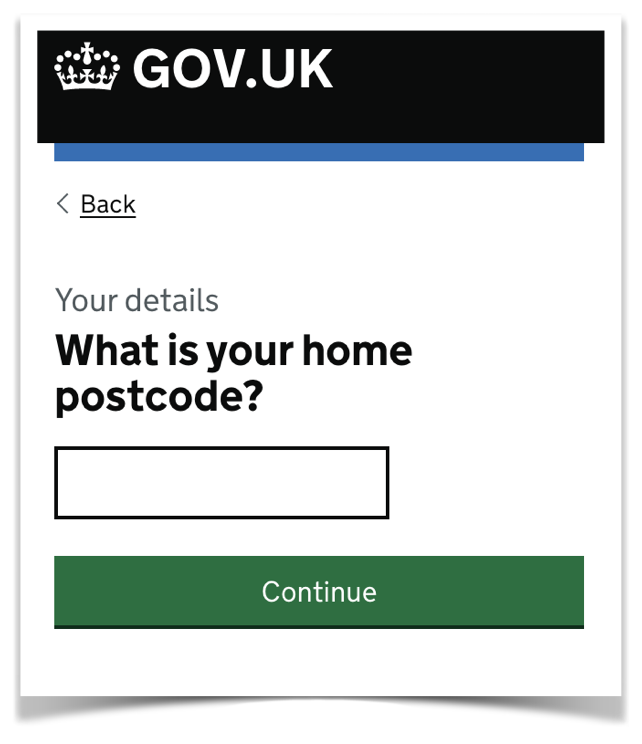
  </div>
</div>

---

### Your page title and your page description should be consistent

In most cases, the `<title>` and the `<h1>` should be identical.

```html
<title>What is you name? – Apply for Universal Credit</title>

<h1>What is your name?</h1>
```

---

### Personal information is the exception

The page title may be passed to analytics software and that needs to be anonymous.

If the `<h1>` contains personal information, the `<title>` should be different but consistent.

```html
<title>What is your partners date of birth? – Apply for Marriage Allowance</title>

<h1>What is John Smith's date of birth?</h1>
```

---

## 4.1.2 Name, Role, Value

The intent of this Success Criterion is to ensure that Assistive Technologies can gather information about, activate (or set) and keep up to date on the status of user interface controls in the content.

<!-- _footer: '[WCAG criterion 4.1.2 Name, Role, Value](https://www.w3.org/WAI/WCAG21/Understanding/name-role-value.html)' -->

---

### Name

Anything which is interactive needs to have an accessible name so a screen reader can set expectations with the user.

Text is the easiest way to give an element a name.

```html
<button>
  Play
</button>
```

---

### You can use CSS to visually hide text from the screen

You can visually hide it, but don’t use `display:none` or `visibility:hidden` or it will also be hidden to assistive technology.

```html
<button class="play-btn">
  <span class="visually-hidden">Play</span>
</button>
```

---

### Alt text on an image will count as an accessible name

The text in the alt attribute will become the accessible name in the accessibility tree.

```html
<button>
  
</button>
```

---

### An aria-label will also count as a name

ARIA labels can make your code more complex and difficult to read. You might also fail [1.3.1 Info and Relationships](https://www.w3.org/WAI/WCAG21/Understanding/info-and-relationships.html) if there is no visual label. So be careful!

```html
<button aria-label="play"></button>
```

---

## Role

The role allows users to recognise interactive elements and interact with them in a predictable way. 

*If it looks like a thing, it should behave like that thing.*

---

### Implicit roles

All interactive elements will have an implicit role, so if you’re using them properly you shouldn’t have to worry about it.

For example:
- `<a>` = link
- `<button>` = button
- `` = img
- `` = presentation
- `<input type="text">` = text input

---

### Mismatched roles

Making a link look like a button using CSS styling, without giving it the correct role, is a really common failure.

```html
<a class=“btn”>
  Register
</a>
```

---

### If it looks like a button, it must behave like a button

If you change the style to look like something else, then you also need to change the role.

```html
<a class=“btn” role=“button”>
  Register
</a>
```

---

### Value

For interface components which have changeable states such as sliders or expandable sections, then the information must be available to assistive technologies.

Bad example:
```html
<div class=“accordion open”>
```

Good example:
```html
<div class=“accordion” aria-expanded=“true” open=“true”>
```

---

## 2.4.4 Link Purpose (In Context)

The intent of this Success Criterion is to help users understand the purpose of each link so they can decide whether they want to follow the link. 

Whenever possible, provide link text that identifies the purpose of the link without needing additional context.

<!-- _footer: '[WCAG criterion 4.1.2 Link Purpose (In Context)](https://www.w3.org/WAI/WCAG21/Understanding/link-purpose-in-context.html)' -->

---

### Examples of links

Good example:
You can read more about the [GOVUK Design System](https://design-system.service.gov.uk/).

Bad example:
You can [read more](https://design-system.service.gov.uk/) about the GOVUK Design System.

---

#### Technically, the bad example might still pass

A bad example can pass depending on the surrounding text, but it becomes subjective.

Potential pass:
```html
<p>You can <a href="#">read more</a> about the GOV.UK Design System.</p>
```

Definite fail:
```html
<p>You can find more examples in the GOV.UK Design System.</p>
<p><a href="#">Read more</a></p>
```

---

#### Context may not help screen reader users

Even if it’s technically a pass, using links “in context” means some screen reader functionality will be broken.

<p>
  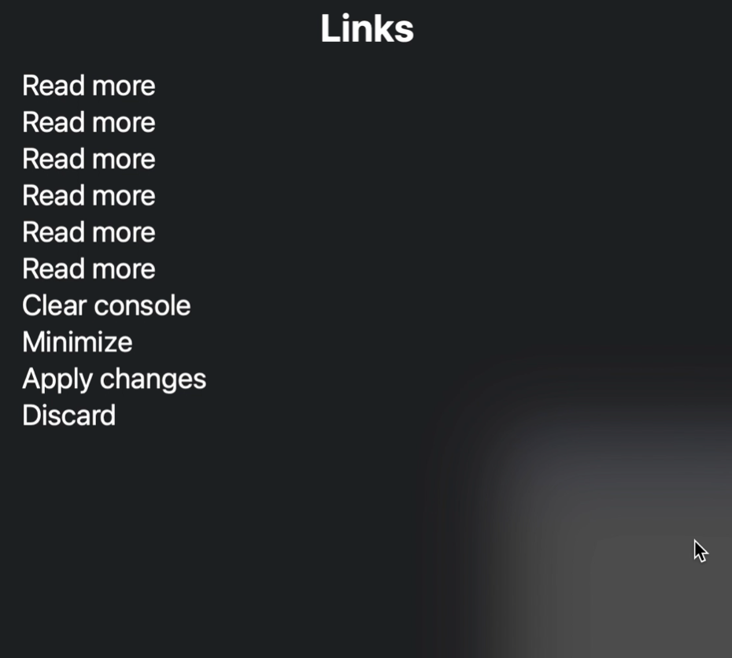
</p>

---

#### Always work to 2.4.9 Link Purpose (Link Only)

If you work to [2.4.9 Link Purpose (Link Only)](https://www.w3.org/WAI/WCAG21/Understanding/link-purpose-link-only.html) you will always pass [2.4.4 Link Purpose (In Context)](https://www.w3.org/WAI/WCAG21/Understanding/link-purpose-in-context.html) and create fewer barriers for people

If you write bad links and rely on that additional context, the outcome of your accessibility audit then becomes subjective, and you want to be certain it will pass!

---

## 1.4.3: Contrast (Minimum)

The intent of this Success Criterion is to provide enough contrast between text and its background so that it can be read by people with moderately low vision (who do not use contrast-enhancing assistive technology).

<!-- _footer: '[WCAG criterion 1.4.3 Contrast (Minimum)](https://www.w3.org/WAI/WCAG21/Understanding/link-purpose-link-only.html)' -->

---

### Contrast ratio: large vs normal

WCAG says:
- Large text must have a contrast ratio of 3:1
- Normal text must have a contrast ratio of 4.5:1

---

### Font size: large vs normal

WCAG says:
- Large, is text that is 18pt or larger
- Or, 14pt or larger and bold

So, by process of elimination, it means normal text is anything which is smaller than 18pt and not bold.

---

### Points (pt) vs Pixels (px)

When comparing points to pixels:
- 18pt is roughly 24px
- 14pt is roughly 19px

So if your font size is:
- 24px or larger, you need a 3:1 ratio
- 19px or larger and bold, you need a ratio of 3:1
- Smaller than 24px and not bold, you need a ratio of 4.5:1

---

### Contrast Minimum example

<div class="row">
  <div class="col">
    <p>Pass:</p>
    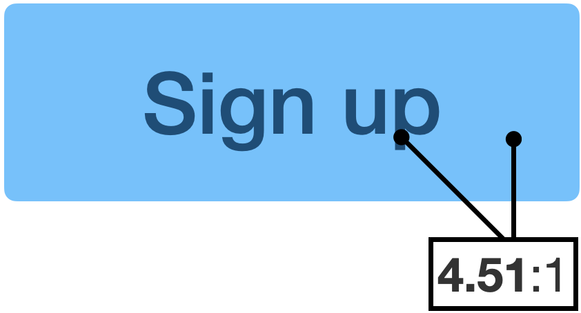
  </div>
  <div class="col">
    <p>Fail:</p>
      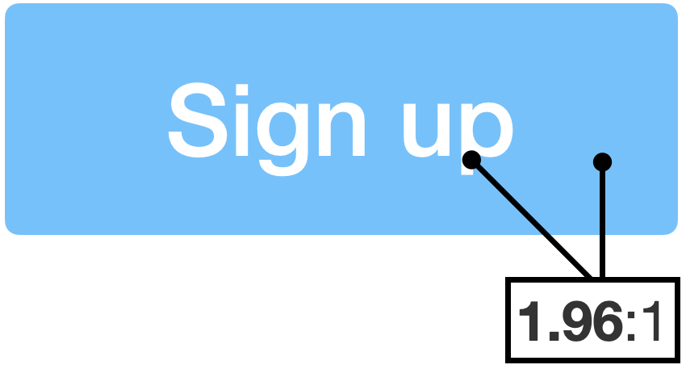
  </div>
</div>

---

## 1.4.11: Non-text Contrast

The intent of this Success Criterion is to ensure that active user interface components (i.e., controls) and meaningful graphics are distinguishable by people with moderately low vision.

<!-- _footer: '[WCAG criterion 1.4.11 Non Text Contrast](https://www.w3.org/WAI/WCAG21/Understanding/non-text-contrast.html)' -->

---

### Non-text Contrast is the colour contrast of things which are not text

For example:
- Icons
- Button styles
- Focus styles

---

### Same example, different fail

We established earlier, the dark blue text against the light blue background meets the minimum standard for [1.4.3: Contrast (Minimum)](https://www.w3.org/WAI/WCAG21/Understanding/contrast-minimum.html).

<P>
  
</P>

---

## 1.4.11: Non-text Contrast

The blue background against the white is so poor some people may not be able to see it, so it won’t be perceivable as a button at all. So it fails on a different WCAG criterion.

Fail example:
<P>
  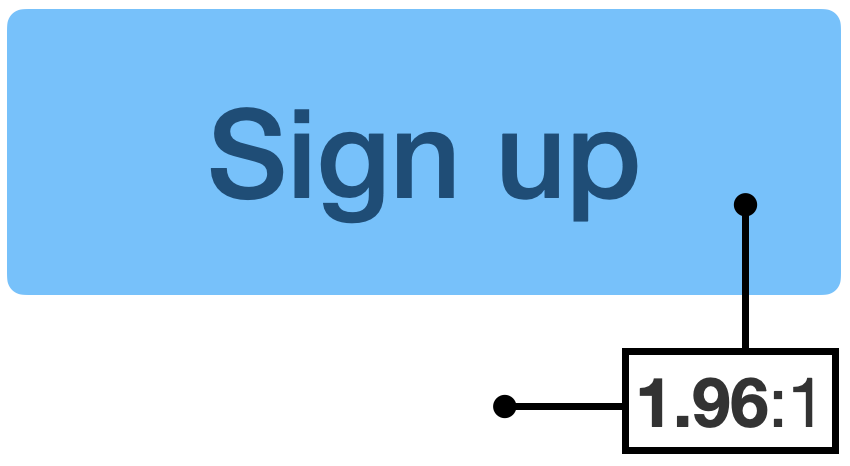
</P>

---

### Borders count as contrast

By adding a border which meets the minimum standard, the fact the light blue fails no longer matters. The background of the button could be white and it would still look like a button.

Pass example:
<P>
  
</P>

---

### Focus styles 

Focus styles are often overlooked when it comes to contrast. This is for keyboard users when they are tabbing through interactive elements.

---

### Low contrast focus colour

When the item is focused, it is now again failing on colour contrast because the pink is not strong enough against the white.

<P>
  
</P>

---

### Fixing focus styles to meet the requirements

You can get creative. There are many ways to do it, just make sure there is at least 1 visual indicator which meets the contrast ratio.

<div class="row">
  <div class="col">
    <p>Pass by adding a border:</p>
    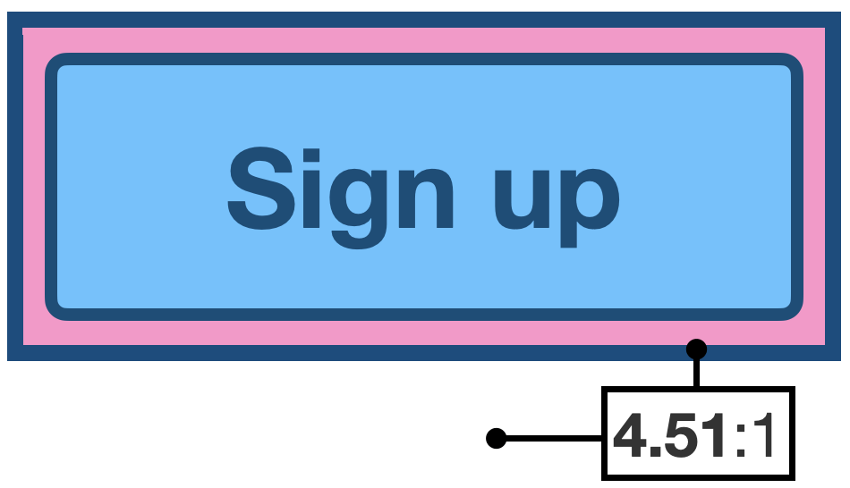
  </div>
  <div class="col">
    <p>Pass by changing the background:</p>
      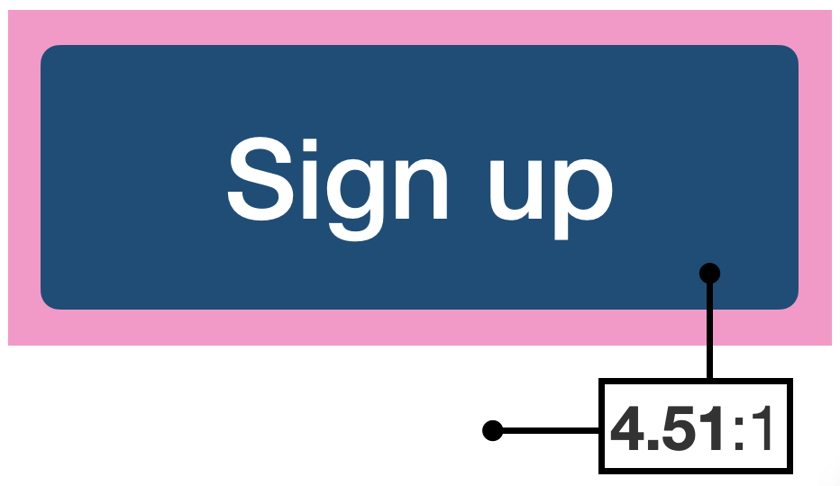
  </div>
</div>

---

### People wrongly assume colour contrast is a blocker to creativity and branding 

It does not fail if there is enough contrast to distinguish what the element is supposed to be. It only fails if you’re not smart about how you accent your colour palette.

---

## 1.3.1 Info and relationships

The intent of this Success Criterion is to ensure that information and relationships that are implied by visual or auditory formatting are preserved when the presentation format changes. For example, the presentation format changes when the content is read by a screen reader or when a user style sheet is substituted for the style sheet provided by the author.

<!-- _footer: '[WCAG criterion 1.3.1 Info and Relationships](https://www.w3.org/WAI/WCAG21/Understanding/info-and-relationships.html)' -->

---

### Info and Relationships is about how content is perceived

If you can *see* a visual relationship on the page, that relationship must also be available to a assistive technology. 

---

### Oprpaned Labels

Orphaned labels are where they are visually related, but they're not linked together in the code.

Fail:
```html
<label>Full Name</label>
<input type=“text”>
```

Pass:
```html
<label for=“name”>Full Name</label>
<input id=“name” type=“text”>
```

---

## Headings not marked up correctly

Don't just make text *look* like a heading. Make sure you use the correct heading tag.

Fail:
```html
<p class=“heading-xl”>
  WCAG 2.1
</p>
```

Pass:
```html
<h2 class=“heading-xl”>
  WCAG 2.1
</h2>
```
---

## WCAG is hard!

It’s so fragmented its easy to make mistakes. 

For headings or labels you actually need to cover 3 different criteria:
- headings and labels need to be marked up correctly
- headings and labels need to make sense
- all inputs need to have a label

*Note, at level AA WCAG, does not care if headings are missing. Just that if you have them, they are marked up correctly and make sense.*

---

### How does 1.3.1 Info and Relationships apply to headings and labels?

It *does not* matter if:
- headings or labels are missing from the page
- headings or labels do not make sense

It *only* matters that:
- if there are headings and labels on the page, they are marked up correctly

---

### How does 2.4.6 Headings and Labels apply?

It *does not* matter if:
- headings and labels are missing from the page
- headings and labels are not marked up correctly

It *only* matters that:
- if there are headings and labels, they make sense

---

### How does 3.3.2 Labels or Instructions apply?

It *does not* matter if:
- labels are marked up correctly
- the label does not make sense

It *only* matters if:
- It only cares if they are missing from the page.

---

## Basic Accessibility Checks

We've compiled a list of 10 checks which cover all of the WCAG issues we see fail regularly!

It won't tell you if your website is 100% compliant. But it will let you know very quickly if it has some of the major barriers we see.

<!-- _footer: '[Basic accessibility checks](https://accessibility-manual.dwp.gov.uk/tools-and-resources/basic-accessibility-checks)' -->

---

### It also humanises a lot why each check is important

For example:

Charlie has Retinitis Pigmentosa, also known as “tunnel vision”. They have no vision in their right eye, but have a narrow vertical band of usable vision in the left.

They are registered blind, but try not to use a screen reader as they still find it easier to read themselves. To help, they have a monitor mounted in portrait mode, slightly off centre to the left of their desk.

If the website does not reflow to work in portrait mode, it does not fit into Charlie’s vertical band of vision and their ability use the website is significantly impacted.

---

### 10 checks cover around half of the WCAG AA criteria, and all of the ones we see fail regularly!

1. [Automated tools](https://accessibility-manual.dwp.gov.uk/tools-and-resources/basic-accessibility-checks#1-automated-tools)
2. [Responsive design](https://accessibility-manual.dwp.gov.uk/tools-and-resources/basic-accessibility-checks#2-responsive-design)
3. [Keyboard accessibility](https://accessibility-manual.dwp.gov.uk/tools-and-resources/basic-accessibility-checks#3-keyboard-accessibility)
4. [Headings and labels](https://accessibility-manual.dwp.gov.uk/tools-and-resources/basic-accessibility-checks#4-headings-and-labels)
5. [Page title](https://accessibility-manual.dwp.gov.uk/tools-and-resources/basic-accessibility-checks#5-page-title)
6. [Links and buttons](https://accessibility-manual.dwp.gov.uk/tools-and-resources/basic-accessibility-checks#6-links-and-buttons)
7. [Colour contrast](https://accessibility-manual.dwp.gov.uk/tools-and-resources/basic-accessibility-checks#7-colour-contrast)
8. [Images](https://accessibility-manual.dwp.gov.uk/tools-and-resources/basic-accessibility-checks#8-images)
9. [Announcements and alerts](https://accessibility-manual.dwp.gov.uk/tools-and-resources/basic-accessibility-checks#9-announcements-and-alerts)
10. [Session timeouts](https://accessibility-manual.dwp.gov.uk/tools-and-resources/basic-accessibility-checks#10-session-timeouts)

---

## Thank you!
Craig Abbott
Head of Accessibility, Digital
[@abbott567](https://twitter.com/abbott567)
