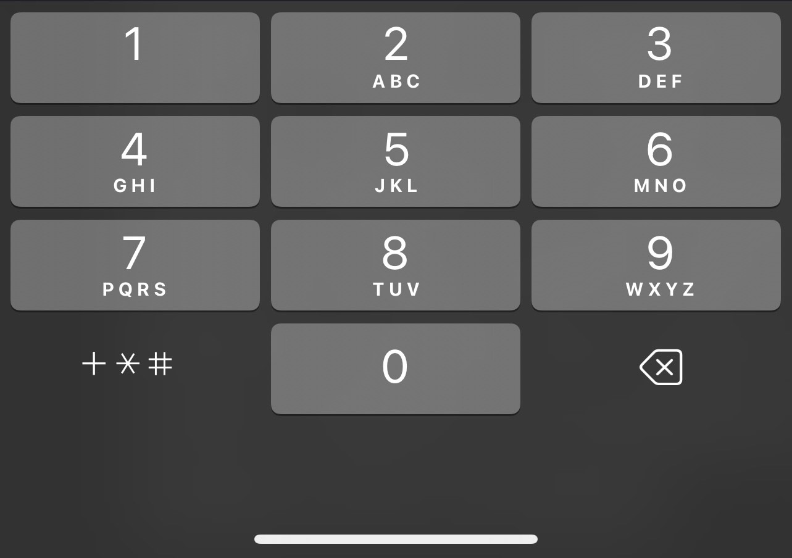
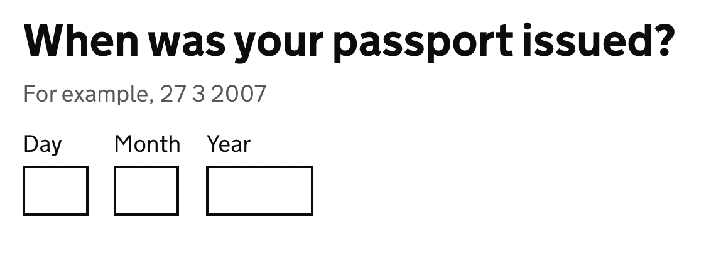

---

title: HTML Forms - National Coding Week
description: Session on HTML forms for National Coding Week.
paginate: true
marp: true
theme: purple-theme

---

# HTML Forms
Craig Abbott
Head of Accessibility, Digital
[@abbott567](https://twitter.com/abbott567)

---

## Forms are the backbone of all Digital Services

When you apply or renew anything on GOV.UK it's essentially just a well designed web form.

---

## "Users prefer less clicks" is one of the most persistent design myths

Research shows that breaking complex things into small manageable parts creates a more successful user journey.

---

## Forms should be dynamic and as easy as possible to use

The user should not have to engage with anything which is not relevant.

Bad example: 
<i>Only answer this question if you answered 'yes' to the previous one</i>

---

## The basic building blocks of forms
- The form element
- Input elements
- Labels
- Legends
- Form groups

---

## The form element

Inputs must be placed inside a `<form>` element. This creates a landmark so assistive technology users can find interactive elements easier.

```html
<form>
  <label for="username">Username</label>
  <input id="username" type="text">

  <label for="password">Password</label>
  <input id="password" type="password">

  <button>Sign in</button>
</form>
```

<!-- _footer: '[The Form Element on MDN](https://developer.mozilla.org/en-US/docs/Web/HTML/Element/form)' -->

---

## Input element

The input element is the main way to collect data from a user. They may type data into a field, or they may select options using buttons.

<!-- _footer: '[The Input Element on MDN](https://developer.mozilla.org/en-US/docs/Web/HTML/Element/input)' -->

---

### Inputs you type in

Some common inputs you type in are:
- [date](https://developer.mozilla.org/en-US/docs/Web/HTML/Element/input/date)
- [email](https://developer.mozilla.org/en-US/docs/Web/HTML/Element/input/email)
- [number](https://developer.mozilla.org/en-US/docs/Web/HTML/Element/input/number)
- [password](https://developer.mozilla.org/en-US/docs/Web/HTML/Element/input/password)
- [search](https://developer.mozilla.org/en-US/docs/Web/HTML/Element/input/search)
- [tel](https://developer.mozilla.org/en-US/docs/Web/HTML/Element/input/tel)
- [text](https://developer.mozilla.org/en-US/docs/Web/HTML/Element/input/text)

---

### Input types you select

Some common input types you click on or select using a keyboard:
- [button](https://developer.mozilla.org/en-US/docs/Web/HTML/Element/input/button)
- [checkbox](https://developer.mozilla.org/en-US/docs/Web/HTML/Element/input/checkbox)
- [radio](https://developer.mozilla.org/en-US/docs/Web/HTML/Element/input/radio)
- [submit](https://developer.mozilla.org/en-US/docs/Web/HTML/Element/input/submit)

---

### The 'type' is used for 3 things
- To activate HTML5 validation
- To set context for screen readers
- To show the correct virtual keyboard on devices like mobile phones

---

### HTML5 validation is not recommended

It is not robust and it can get confusing.

Turning off HTML5 validation means you can implement your own accessible validation patterns using good content and interaction design.

---

#### Demo of HTML5 validation

Can be found at the following path:
`/demos/html5-validation.html`

<!-- _footer: '<a href="./demos/html5-validation.html" target="_blank">Demo of HTML5 validation (opens in a new tab)</a>' -->
---

### The type of input can add context for screen reader users

If it reads out <i>"input, type equals email"</i>, then it's clear that it you need to put an email address in the field.

---

#### But, the context is not always consistent

For example, `type="number"` may be called an <i>"incremental edit text number field"</i> in Safari. In Chrome and Firefox it may be called a <i>"stepper"</i>. 

In Firefox there is sometimes a bug where it reads out <i>"NaN"</i> (not a number) when the field is empty.

---

### The number type is a bit broken

It has the following accessibility issues:
- [Chrome silently discards non-numeric input](https://github.com/alphagov/govuk-frontend/issues/1449#issuecomment-503186819)
- [users can accidentally change number using the arrow keys without realising](https://github.com/alphagov/govuk-frontend/issues/1449#issuecomment-503186819)
- [users can accidentally change the number using the scroll wheel on the mouse or the scroll gesture](https://bradfrost.com/blog/post/you-probably-dont-need-input-typenumber/)
- [they appear as unlabeled in NVDA's element list](https://github.com/alphagov/reported-bugs/issues/41)
- [users of Dragon Naturally Speaking cannot dictate into them as expected](https://github.com/alphagov/reported-bugs/issues/34)

---

### Dates can also be problematic

For example:
- Voiceover may ignore the label
- Voiceover can read dates as percentages
- Chrome, Safari and Firefox have inconsistent date pickers
- Chrome and Firefox date pickers may not be keyboard accessible
- Firefox bug which jams Voiceover when using a mouse
- Safari has a bug which doesn't complete the full date when using Voiceover

---

### Demo of input types

Can be found at the following path:
```/demos/input-types.html```

<!-- _footer: '<a href="./demos/input-types.html" target="_blank">Demo of input types (opens in a new tab)</a>' -->

---

### Research shows that text inputs can be made to work for most things

But, you need to have a clear label, and you need to provide additional attributes so browsers know which virtual keyboard to show.

---

#### The inputmode attribute can tell the browser which keyboard to show

This is particularly important for mobile devices.

```html
<label for="age">Age</label>
<input id="age" type="text" inputmode="number">
```

<!-- _footer: '[The Inputmode attribute on MDN](https://developer.mozilla.org/en-US/docs/Web/HTML/Global_attributes/inputmode)' -->

---

##### Examples of virtual keyboards 

<div class="row">
<div class="col">

`inputmode="text"`
<div>
  
</div>

</div>
<div class="col">

`inputmode="email"`
<div>
  
</div>

</div>
<div class="col">

`inputmode="tel"`
<div>
  
</div>

</div>
</div>

---

#### The text type can work better for numbers

```html
<label for="age">Age</label>
<input id="age" type="text" inputmode="numeric" spellcheck="false">
```

More advanced examples can be found in the [GOV.UK Design System](https://design-system.service.gov.uk/).

<!-- _footer: '[The GOVUK text input component](https://design-system.service.gov.uk/components/text-input/)' -->

---

#### The text type is also better for dates

Again, a good example can be found in the [GOV.UK Design System](https://design-system.service.gov.uk/):

<p>
  
</p>

<!-- _footer: '[The GOVUK date input component](https://design-system.service.gov.uk/components/date-input/)' -->

---

### Should you use type or inputmode?

As a general rule of thumb:
1. avoid using `type="number"` and `type="date"`
2. use the other `type` attributes if the context is correct
3. for anything else use `type="text"` and assign a suitable `inputmode` for virtual keyboards
4. Test it thoroughly!

---


### Helping the user identify the purpose of each input

For fields which are common on the web, you should mark them up correctly so that the browser can attempt to autocomplete data. You will need this to pass [WCAG criterion 1.3.5 Identify Input Purpose](https://www.w3.org/WAI/WCAG21/Understanding/identify-input-purpose.html)

---

### Autocomplete

By using the right autocomplete values, things like your name and address can be filled in quickly rather than being typed out repeatedly. But it will only work if the browser knows what the field is for.

```html
<input type="text" id="full-name" autocomplete="name">
```

<!-- _footer: '[The autocomplete attribute on MDN](https://developer.mozilla.org/en-US/docs/Web/HTML/Attributes/autocomplete)' -->

---

#### Autocomplete values

There is a full list of autocomplete values. So go through them and match them against your designs.

For example:
- `name` = Full name
- `given-name` = First name
- `family-name` = Last name
- `email` = Email address
- `postal-code` = Postcode

---

#### Autocomplete should only be when users fill in their own data

If people are entering other peoples information, then you want to make sure you disable autocomplete, as some browsers will still *try* to be helpful if it thinks it might recognise a field.

```html
<input id="claimant-name" type="text" autocomplete="off">
```

---

## Labels

Every input needs a text label. This lets the user know what they need to use it for.

---

### Labels and WCAG
Labels are covered by 4 WCAG criteria:
- [1.3.1 Info and relationships](https://www.w3.org/WAI/WCAG21/Understanding/info-and-relationships.html)
- [2.4.6 Headings and labels](https://www.w3.org/WAI/WCAG21/Understanding/headings-and-labels.html)
- [3.3.2 Labels or Instructions](https://www.w3.org/WAI/WCAG21/Understanding/labels-or-instructions.html)
- [2.5.3 Label in name](https://www.w3.org/WAI/WCAG21/Understanding/label-in-name.html)

---

#### To cover all the WCAG criteria
- Every input must have a label
- Labels must be clear
- It must be obvious which input the label is related to
- The visible label must be part of the accessible label
- It must be obvious if a field is required or optional

---

### Assigning labels

There are 2 ways to easily assign a label to an input. You could also use aria, but that overcomplicates things.

<div class="row">
<div class="col">

Using `for` and `id`:
```html
<label for="last-name">
  Last name
</label>

<input id="last-name" type="text">
```

</div>
<div class="col">

Nesting:
```html
<label>
  Last name

  <input type="text">
</label>
```

</div>
</div>

---

#### The 'orphaned' input

A really common accessibility issue is an input which looks like it has a label, but they're not actually assigned to one another correctly.

<div class="row">
<div class="col">

How it looks in the code:
```html
<label>Last name</label>
<input type="text">
```
</div>

<div class="col">

How it looks on the page:

<div>
<label>Last name</label>
<input type="text">
</div>

</div>

</div>

---

##### Demo of orphaned input

Can be found at the following path:
```/demos/orphaned-input.html```

<!-- _footer: '<a href="./demos/orphaned-input.html" target="_blank">Demo of orphaned input (opens in a new tab)</a>' -->

---

### Label in name

You can have different labels for visual and non-visual users. But, what is visible *must* also be in the accessible label too!

Pass example:
```html
<label for="search">Search</label>
<input id="search" aria-label="Search for people, pages or blog posts" type="search">
```

Fail example:
```html
<label for="search">Search</label>
<input id="search" aria-label="Find people, pages or blog posts" type="search">
```

---

#### Demo of label-in-name

Can be found at the following path:
```/demos/label-in-name.html```

<!-- _footer: '<a href="./demos/label-in-name.html" target="_blank">Demo of label in name (opens in a new tab)</a>' -->

---

## The fieldset element

The `<fieldset>` element is used to group related inputs. This provides additional context. You should always use a legend with a fieldset.

---

### Legend element

The `<legend>` provides a label for a grouped elements:
```html
<fieldset>
  <legend>Address</legend>

  <label for="line1">Line 1</label>
  <input id="line1" type="text" autocomplete="address-line1">

  <label for="line2">Line 2</label>
  <input id="line2" type="text" autocomplete="address-line2">

  <label for="town-or-city">Town or city</label>
  <input id="town-or-city" type="text" autocomplete="address-level2">

  <label for="postcode">Postcode</label>
  <input id="postcode" type="text" autocomplete="postal-code">
</fieldset>
```

---

### Demo of fieldset and legend

Can be found at the following path:
```/demos/fieldset-and-legend.html```


<!-- _footer: '<a href="./demos/fieldset-and-legend.html" target="_blank">Demo of fieldset and legend (opens in a new tab)</a>' -->

---

## Required fields

Many websites use an asterisk and assume people will know what it means.

```html
<label for="surname">Surname *</label>
<input id="surname" type="text">
```

---

### If you do use an asterisk, you must explain what it means before people use the form

This will probably do enough to pass WCAG 2.1. But it will still be awful for the user.

```html
<p>Required fields are marked with an asterisk (*).</p>
<form>
  <label for="first-name">First name *</label>
  <input id="first-name" type="text">
</form>
```

---

### Demo of asterisk and required fields

Can be found at the following path:
```/demos/asterisk-and-required-fields.html```

<!-- _footer: '<a href="./demos/asterisk-and-required-fields.html" target="_blank">Demo of asterisk and required field (opens in a new tab)</a>' -->

---

### In user centred design, it's likely most fields will be required

If you don't need it, then why ask for it?

So, rather than marking every required field, you can mark the optional ones instead.
```html
<label>Email (optional)</label>
```

---

## Submitting a form

A form should not submit without a very deliberate action. This is covered by:
- [3.2.1 On Focus](https://www.w3.org/WAI/WCAG21/Understanding/on-focus.html)
- [3.2.2 On Input](https://www.w3.org/WAI/WCAG21/Understanding/on-input.html)

---

### 3.2.1 On focus

This simply means that tabbing to an element with the keyboard does not submit the form.

I've never seen this happen to date. So unless you're doing something weird it's probably not something to worry about.

<!-- _footer: '[WCAG 3.2.1 On Focus](https://www.w3.org/WAI/WCAG21/Understanding/on-focus.html)' -->

---

### 3.2.2 On input

This one is more common. It means you can't submit a form by selecting something other than a deliberate action. 

For example, you can't submit a form by selecting a radio button.

<!-- _footer: '[WCAG 3.2.2 On Input](https://www.w3.org/WAI/WCAG21/Understanding/on-input.html)' -->

---

### Button vs Submit

You should submit a form with a button or by using an input with `type="submit"`.

A `<button>` element is more flexible, you can add images or icons by wrapping them in the code block.

```html
<input type="submit" value="Continue">

<button>
  Continue
  
</button>
```

---

## Errors

Errors are covered by 3 WCAG criteria:
- [3.3.1 Error identification](https://www.w3.org/WAI/WCAG21/Understanding/error-identification.html)
- [3.3.3 Error suggestion](https://www.w3.org/WAI/WCAG21/Understanding/error-suggestion.html)
- [3.3.4 Error prevention (Legal, Financial, Data)](https://www.w3.org/WAI/WCAG21/Understanding/error-prevention-legal-financial-data.html)

---

### Error identification

You must highlight and name the field which caused the error. But, this criterion doesn't really care if you tell the user *why* it's broken.

For example:
<i>There's an error with the date your passport was issued</i>


---

### Error suggestion

Error suggestion goes a step further, and states that you need to tell the user what's wrong with it. 

For example:
<i>The date your passport was issued must be in the past</i>

---

### Error prevention

Error prevention means that the user needs to be able to go review and change any inputs they've used.

Just having a working back button with good session management is acceptable, but a better option is to use the [GOV.UK check answers pattern](https://design-system.service.gov.uk/patterns/check-answers/).

---

### One of the biggest issues with errors is that people don't know they've happened

So here are some other things you can do...

---

### Append 'error' to the page title

This helps screen reader users quickly realise they're still on the same page and there's a problem.

```html
<title>
  Error: When was your passport issued? - Renew your passport - GOV.UK
</title>
```

---

### Use an error summary

Putting an error summary at the top of the page means if somebody has made a mistake then can easily see that there is an error. It also helps people using a screen reader to quickly realise the page has changed.

<div>


</div>

---

### Linking to the fields from the error summary

This makes it easy for users to navigate to the fields to fix them. 

```html
<a href="#first-name">Enter your first name</a>
...
<input type="text" id="first-name">
```

---

### Demo of errors

Can be found at the following path:
```/demos/errors.html```

<!-- _footer: '<a href="./demos/errors.html">Demo of errors (opens in a new tab)</a>' -->

---

## Feedback

I know this was a lot to cram into an hour session and I didn't cover other form elements like radios or checkboxes. 

Please fill out the [feedback form](https://forms.office.com/pages/responsepage.aspx?id=6fbxllcQF0GsKIDN_ob4w3_GoCbBJ0ZFo6Pp3ygGDvZUMkpJV1YwSVJPSE1LQVZZWUZQVkhLS0RBQS4u&wdLOR=c190B5DBC-3581-E246-9246-C53F1AABE0FD), and if there's anything you would like to see in the future let us know and we can structure some more sessions around those topics.

---

## Thank you!
Craig Abbott
Head of Accessibility, Digital
[@abbott567](https://twitter.com/abbott567)
