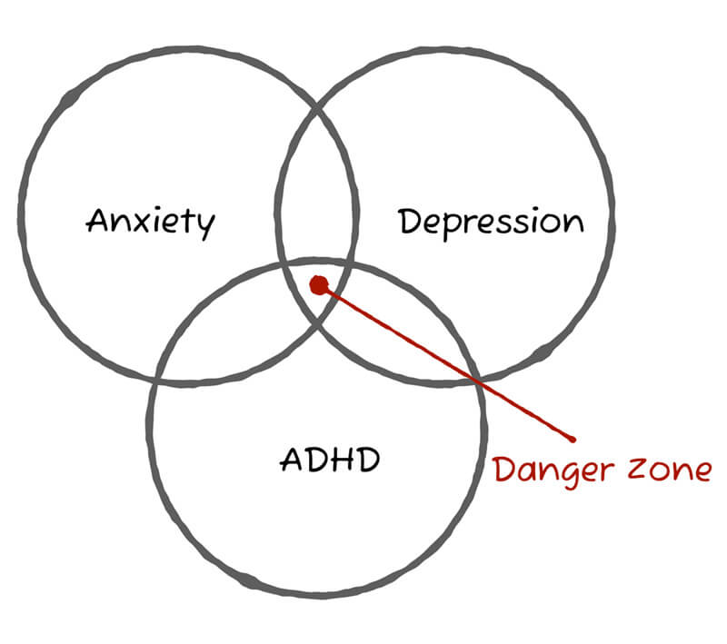
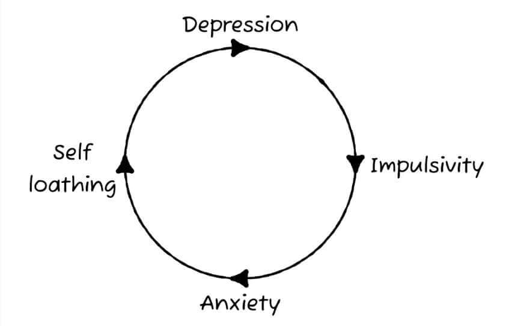

---

title: My ADHD and Me
description: Session on my ADHD and some coping strategies I have put in place.
paginate: true
marp: true
theme: handwritten

---

# My ADHD and Me

Craig Abbott
[@abbott567](https://twitter.com/abbott567)

---

## Hi, my name is Craig
I have [combined presentation ADHD](https://www.additudemag.com/3-types-of-adhd/).

  

---

## What does ADHD stand for?

In this talk, when I use the acronym **"ADHD"**, I am referring to "[Attention Deficit Hyperactivity Disorder](https://www.nhs.uk/conditions/attention-deficit-hyperactivity-disorder-adhd/)".

---

## Before we start…

**I’m not an expert.**

Everything in these slides is just my experience and everybody is different.

The “advice” in these slides is a combination of strategies I’ve made up or borrowed from other people. They may not work for everyone.

---

## ADHD is just one of my issues

I have a few things going on. Most people do, but we just don’t talk about it.

  

---

## Before my diagnosis

I was in and out of counselling trying to understand my own behaviours.

  

---

### Impostor Syndrome

Feeling out of your depth. Like you’re a fraud, and you’re just waiting to be found out.

---

## “It’s textbook ADHD”

I was 35 when the Psychiatrist confirmed my diagnoses. 

---

## Like everybody else, I had a preconceived idea of what ADHD looked like…

…and it wasn’t particularly positive.

---

## The ADHD stigma

A lot of people assume we’ll be running around the office high on blue Smarties, not doing any work and being disruptive.

---

### Attention Deficit, Hyperactivity, Disorder.

The name ADHD implies people are abnormal, easily distracted and wayward.

---

  

### Sir George Still

A British Paediatrician who described some children as having "an abnormal defect of moral control".

He described these children as intelligent, but said they could not control their behaviour in the same way **"typical children"** could.

  

  

  

  

---

#### The problem with Still’s observations

A "lack of moral control" and "serious problems with sustained attention", appear to be entirely based on the children being unable to pay attention to things which **he** considered to be the priority.

---

##### ADHD is not problem with sustained attention

It's is impairment in our ability to choose what we focus on, not an inability to focus at all.

---

## We often have an unrivalled ability to hyper-focus

If something holds our attention, we can [hyper-focus](https://www.additudemag.com/understanding-adhd-hyperfocus/). This can mean ridiculously productive periods for 5-10 hours at a time.

But, as my psychiatrist pointed out, if you forget to eat or check in with your family, then perhaps you’re distracted from life.

---

<figure>
  <dl>
    <dt>
      <h2 lang="mi">Aroreretini</h2>
    </dt>
    <dd>
      Attention goes to many things.
    </dd>
  </dl>
  <caption>
    <i lang="mi">Te Reo Māori</i>
  </caption>
</figure>

<!-- _footer: 'Translation: [Attention goes to many things](https://www.tereohapai.nz/Browse/Terms/mi-NZ#:~:text=Female-,Aroreretini,-Attention%20goes%20to)' -->
---

## Some of my "textbook ADHD" traits

…and how I deal with them.

---

### Task Management

I can prioritise tasks fine on paper, but executing them in order is a challenge. 

I’ll always gravitate towards the interesting tasks first, or accidentally work on them without realising my attention has drifted from the priority.

---

#### Analog Diary

I have a complex diary system based on the original [Bullet Journal](https://bulletjournal.com/) by [Ryder Carroll](https://www.rydercarroll.com/).

---

##### Basic bullet journal

<ul class="list--no-bullet">
  <li>
    <i aria-hidden="true">•&nbsp;&nbsp;</i>A dot represents an&nbsp;Incomplete task
  </li>
  <li>
    <i aria-hidden="true">X </i>An X represents a&nbsp;Completed task
  </li>
  <li>
    <i aria-hidden="true">O </i>A hollow circle represents a&nbsp;Meeting
  </li>
  <li style="text-decoration: line-through;">
    <i aria-hidden="true">•&nbsp;&nbsp;</i>A strike through represents a&nbsp;Cancelled task or meeting
  </li>
  <li>
    <i aria-hidden="true">>&nbsp;</i>A forward arrow represents a task you&nbsp;Didn't finish, move to tomorrow
  </li>
  <li>
    <i aria-hidden="true"><&nbsp;</i>A backwards arrow represents a task you&nbsp;Didn't finish, move to a future date
  </li>
  <li>
    <i aria-hidden="true">-&nbsp;</i>A hyphen represents a&nbsp;Note
  </li>
</ul>

---

###### Highlighters help

<ul class="list--no-bullet">
  <li style="background:#BAFFC9; border-radius:50%; width:50%;">
    <i aria-hidden="true">X </i>Completed tasks are green
  </li>
  <li style="text-decoration:line-through; background:#bae1ff; border-radius:50%; width:50%;">
    <i aria-hidden="true">•&nbsp;&nbsp;</i>Cancelled tasks are blue
  </li>
  <li style="background:#ffb3ba; border-radius:50%; width:50%;">
    <i aria-hidden="true">>&nbsp;</i>Tasks you didn't finish are red
  </li>
  <li style="background:#ffff97; border-radius:50%; width:50%;">
    <i aria-hidden="true">-&nbsp;</i>Notes are yellow
  </li>
</ul>

---

### Time keeping

My ability to monitor or predict time is flawed. It is sometimes known as "[time blindness](https://www.additudemag.com/time-blindness-running-late-adhd/)".

---

#### My internal clock is broken

Almost all animals have a primitive in built clock called [Circadian Rhythm](https://en.wikipedia.org/wiki/Circadian_rhythm). 

Most adult humans develop an innate awareness of time and the passing of it. 

My internal clock is broken. I cannot guess what time it is, or accurately guage the passing of it.

---

#### Routines and alarms

I rely heavily on routines and alarms. If I don’t set alarms, 1 hour can pass in what feels like 10 minutes.

---

#### Pomodoro Technique

I set a timer for 25 minutes on my phone and remove all distractions. 

After 25 minutes, have a 5 minute break and then repeat.

---

### Organisation

Expensive stuff has a dedicated place and I know where it is at all times.

Inexpensive things, I have more than one so finding it is doesn’t drive me crazy.

---

  

#### Organised chaos

When I find a system or product which works for me, I duplicate it. 

It’s easier to remember the right bag than the 20 things I need to put in it.

  

  

    

      
    

  

---

### Emotional Dysregulation

I struggle with highs that are too high and lows that are too low. In the extremes I get overwhelmed and I shut down.

<!-- _footer: '[Emotional Numbness and the Spectrum of ADHD Feelings](https://www.additudemag.com/emotional-numbness-adhd-adults/)' -->

---

#### Complete numbness

Just an absolute lack of feeling for anything good or bad. 

In these times I can’t find tears and I can’t find joy. I become disinterested in hobbies and I can seem cold or robot-like.

---

#### Dopamine Dysregulation

Studies suggest people with ADHD are more likely to struggle with addiction because we appear to regulate important brain chemicals like dopamine differently.

<!-- _footer: '[Attention-deficit-hyperactivity disorder and reward deficiency syndrome](https://www.ncbi.nlm.nih.gov/pmc/articles/PMC2626918/)' -->

---

##### The cycle of dopamine hunting

I get consumed by new interests, only to suddenly find them utterly disinteresting a few weeks later.

---

##### My dopamine hunting pattern

1. Discover new thing
2. Become obsessed with it
3. Buy tools and equipment
4. Get bored
5. Go back to step 3 a few times
6. Quit and sell everything

---

##### Dopamine and addiction

We get hooked on the highs of the dopamine hits, and insidiously justify our behaviours to ourselves to get more of them.

It could be why your diet always starts on Monday, why your credit cards are always maxed out, or why going out for ‘a few drinks’ always ends up with you staggering home at 7am.

<!-- _footer: '[Never Enough? Why ADHD Brains Crave Stimulation](https://www.additudemag.com/brain-stimulation-and-adhd-cravings-dependency-and-regulation/)' -->

---

###### Some addictions are not frowned upon by society, so it makes it more difficult

The two things I still consistently struggle with are junk food and impulsive purchases.

Nobody really gets concerned if I eat 3 chocolate bars or buy a camera.

---

## Getting a diagnosis

I have to again stress **this is my personal journey**. Other peoples experiences or advice may vary. 

I am not paid by or in any way affiliated with any services I recommend in this section.

---

### NHS vs Private

Whenever I’ve tried to access [NHS Mental Health Services](https://www.nhs.uk/nhs-services/mental-health-services/) they seem completely overwhelmed.

---

#### Talking Therapies waiting times

When I needed counselling, I was told the waiting list for [NHS Talking Therapies](https://www.nhs.uk/mental-health/talking-therapies-medicine-treatments/talking-therapies-and-counselling/types-of-talking-therapies/) would be more than 12 months. 

If I was suicidal, or what they deemed to be **"in crisis"**, it was reduced, but it was still estimated to be around 3 months.

---

#### I went to North East Counselling Services

When I went, it was around £45 per session, but they do sometimes have funding available to be able to offer it at a reduced cost or for free.

<!-- _footer: '[North East Counselling Services](https://necounselling.org.uk/)' -->

---

#### Anxious Minds

Anxious Minds is another North East mental health service which can offer reduced price counselling.

<!-- _footer: '[Anxious Minds](https://www.anxiousminds.co.uk/)' -->

---

### ADHD diagnosis

Through the NHS, I would have been looking at around 15 to 24 months at least. 

There seems to be a greater desire just to write prescriptions to treat those comorbid conditions like anxiety and depression. 

I often came away from the GP meetings with anti-depressants and anti-anxiety medications, rather than the answers I needed.

---

#### I got my diagnosis through Psychiatry-UK.com

But at the time of writing this, they currently don’t have any appointments available for 6 months. 

This again highlights the overwhelming need for more mental health services in the UK.

---

#### Going private is expensive

It cost me around £360 to get a diagnosis.

This doesn't include treatment which you have to pay for separately.

---

##### Paying for medication privately can be *REALLY* expensive

It will cost you around:
- £80 in nurse fees
- £25 in prescription fees
- £150 to buy a 28 days supply of [Elvanse](https://www.netdoctor.co.uk/medicines/adhd-add/a8828/elvanse-lisdexamfetamine/)

You won’t be allowed on NHS dispensation until you have worked with your private physician to get the dosage correct.

---

## Life after the diagnosis

When I was first diagnosed, I doubted if I knew myself at all. But now, I embrace the fact that I’m a bit different.

ADHD does not define me as a person. But, whether I like it or not, it is part of who I am.

---

### ADHD can be overwhelming, erratic and destructive.

But, if you can tame it, sometimes it can feel like a super-power.

---

### I get a lot done, but sometimes at a cost

I’m passionate and I get things done. I’m probably not what you’d imagine when you think about somebody who has ADHD.

But I don’t look after myself properly. I work too many hours and I burn out regularly. So I won’t pretend to have everything figured out.

---

## I’m always open to talking about mental health

You’d be surprised how many people are not neurotypical and just hide it. If you have any questions, just reach out.

My Direct Messages on Twitter are always open.

<!-- _footer: '[@abbott567](https://twitter.com/abbott567)' -->
---

## Thanks!

Craig Abbott,
[@abbott567](https://twitter.com/abbott567)
